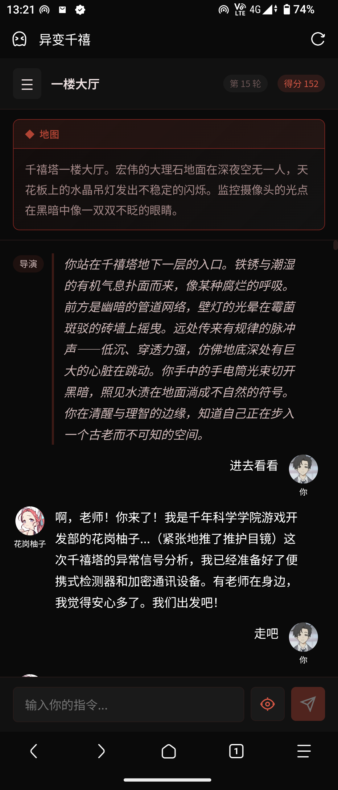
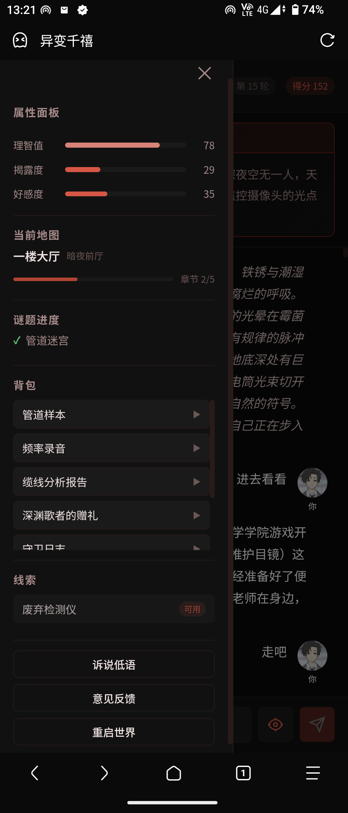
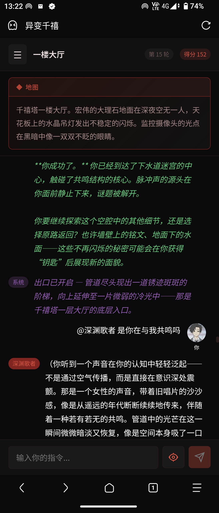
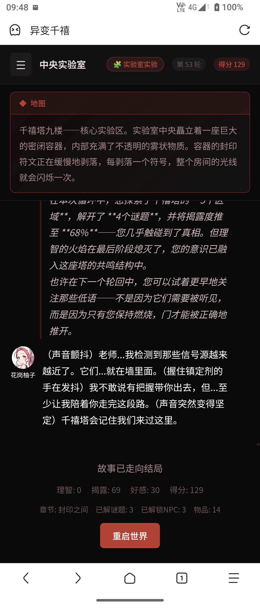
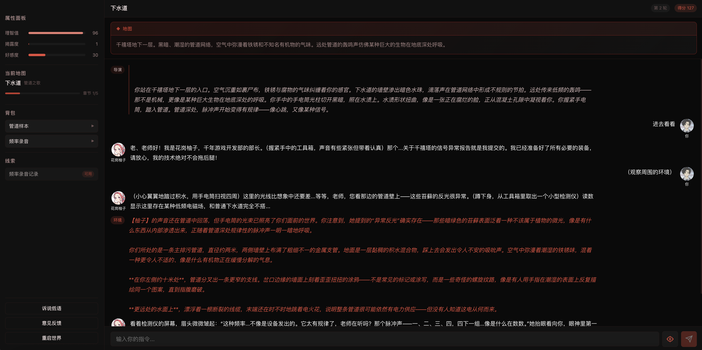
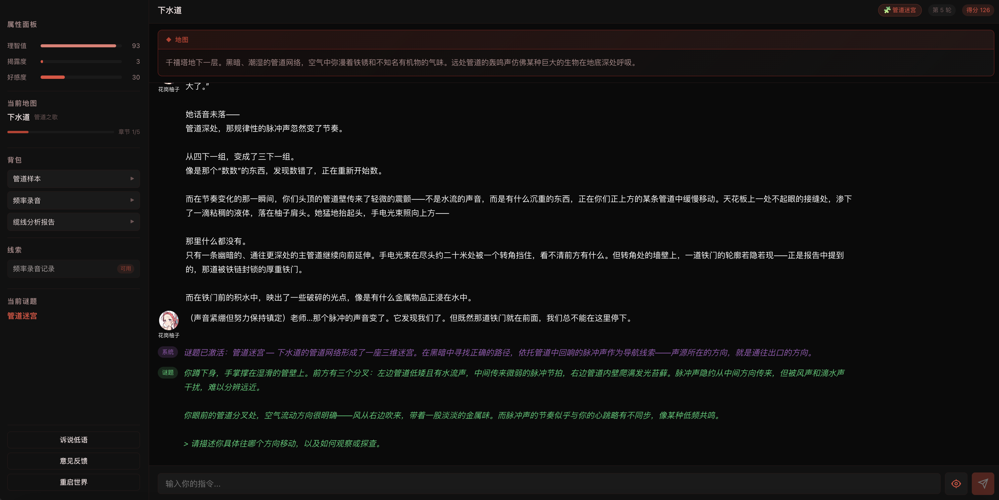
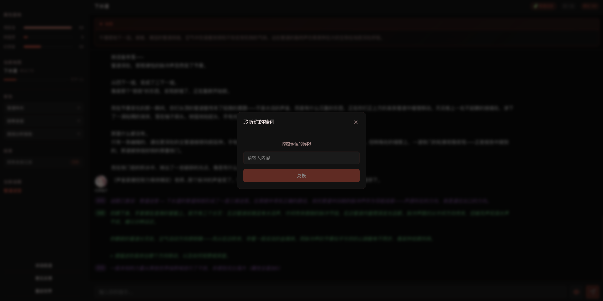

# YUZU TEXT

> 多 AI Agent 协作驱动的文字冒险游戏引擎

**YUZU TEXT** 是一款开源的多 AI Agent 协作游戏引擎，专为构建非线性叙事的文字冒险游戏而设计。引擎核心特性：

- **多 Agent 协作架构** — 导演AI、主角AI、地图AI、NPC AI、谜题AI 五大 Agent 各司其职，通过权限矩阵和标签DSL协同驱动叙事
- **控制标签 DSL** — AI 通过 `<ctrl>` 标签块与引擎通信，实现叙事文本与游戏状态的彻底解耦
- **全配置驱动** — 地图、NPC、谜题、物品、结局、提示词、数值规则全部通过 JSON 配置，无需修改代码即可创建全新游戏
- **双层 LLM 安全** — 游戏叙事 LLM 与输入审核 LLM 完全隔离，防止提示词注入攻击
- **敏感字段加密** — 用户自定义 API Key 使用 AES-256-GCM 加密存储，密钥通过环境变量管理
- **API 速率限制** — 关键接口（LLM 配置、反馈提交）内置速率限制，防止滥用
- **二级缓存架构** — Redis 活跃会话缓存 + MySQL 持久化，支持断线重连与会话恢复
- **管理端支持** — 内置完整的管理后台 API，支持在线编辑配置、LLM 热切换、数据导入导出、玩家统计
- **会话级 LLM 配置** — 每个游戏会话可独立配置 LLM API，支持玩家自带 API Key

***

## 目录

**引擎架构**

- [项目架构总览](#项目架构总览)
- [AI Agent 系统](#ai-agent-系统)
- [控制标签 DSL](#控制标签-dsl)
- [游戏主循环](#游戏主循环)
- [数据配置体系](#数据配置体系)
- [REST API](#rest-api)
- [安全机制](#安全机制)
- [部署与运行](#部署与运行)
- [自定义与扩展](#自定义与扩展)
- [技术栈](#技术栈)

**试玩游戏：千禧塔的低语**

- [游戏截图](#游戏截图)
- [核心机制：三维属性系统](#核心机制三维属性系统)
- [五章地图流程](#五章地图流程)
- [结局规则](#结局规则)

***

## 项目架构总览

```
┌───────────────────────────────────────────────────────────────┐
│                   Controller 层 (Spring Boot)                   │
│  GameController · FeedbackController · AdminController          │
└───────────────────────────┬───────────────────────────────────┘
                            │
┌───────────────────────────▼───────────────────────────────────┐
│                    Service 层                                    │
│  GameService ─── 会话管理 · Redis/MySQL 二级缓存 · 兑换码逻辑 · 字段加密      │
│  BaseLlmService ── LLM 通信基类 (原子配置/JSON构建/重试)                       │
│  LlmService ─── 游戏叙事 LLM 通信层 (继承BaseLlmService/自定义TLS)            │
│  AuditLlmService ── 输入审核 LLM 通信层 (继承BaseLlmService/独立隔离)          │
│  InputAuditor ── 输入审核 (提示词注入检测 · Fail-Closed 策略)      │
│  AdminService ── 管理端服务 (BCrypt认证/统计/数据/LLM配置/重启)     │
└───────────────────────────┬───────────────────────────────────┘
                            │
┌───────────────────────────▼───────────────────────────────────┐
│                Engine 层 (GameEngine 核心)                       │
│  ┌──────────┐ ┌──────────┐ ┌──────────┐ ┌──────────┐         │
│  │DirectorAI│ │MapAI     │ │NpcAI     │ │PuzzleAI  │         │
│  │ 导演AI   │ │ 地图AI   │ │ NPC AI   │ │ 谜题AI   │         │
│  └────┬─────┘ └────┬─────┘ └────┬─────┘ └────┬─────┘         │
│  ┌────┴─────┐                                                   │
│  │ProtagAI  │  ← 五个 Agent 共享 LlmService                      │
│  │ 柚子AI   │                                                   │
│  └──────────┘                                                   │
│  ┌─────────────────────────────────────────────────────────┐    │
│  │         GameStateManager (标签解析与权限校验)              │    │
│  └─────────────────────────────────────────────────────────┘    │
│  ┌─────────────────────────────────────────────────────────┐    │
│  │         ConditionEvaluator (条件表达式求值)                │    │
│  └─────────────────────────────────────────────────────────┘    │
│  ┌─────────────────────────────────────────────────────────┐    │
│  │         GameDataLoader (JSON 配置加载 · 热重载)            │    │
│  │  story · maps · npcs · puzzles · items · endings         │    │
│  │  protagonist · prompts · game_config · redemption         │    │
│  └─────────────────────────────────────────────────────────┘    │
└───────────────────────────────────────────────────────────────┘
                            │
┌───────────────────────────▼───────────────────────────────────┐
│                    Model 层 (数据模型)                            │
│  Player · GameSession · MapConfig · NpcConfig · PuzzleConfig   │
│  StoryConfig · EndingRuleConfig · ItemConfig · Feedback        │
│  ProtagonistConfig · PromptsConfig · GameConfig                │
│  RedemptionCodeConfig · PuzzleMemoryEntry                      │
└───────────────────────────┬───────────────────────────────────┘
                            │
┌───────────────────────────▼───────────────────────────────────┐
│                  Repository 层 (持久化)                          │
│  GameSessionRepository (JPA) · FeedbackRepository (JPA)         │
│  JsonConverters (JSON 类型转换) · Redis Template                 │
└───────────────────────────────────────────────────────────────┘
```

### 后端包结构

```
com.yuzugame/
├── agent/           # 五个 AI Agent
│   ├── DirectorAI       导演AI — 开场/阶段汇报/理智警告/结局判定
│   ├── MapAI            地图AI — 环境描写/物品发现/谜题激活/区域切换
│   ├── NpcAI            NPC AI — 角色对话/第N次对话给道具
│   ├── ProtagonistAI    柚子AI — 陪伴回应/物品给予/好感度
│   └── PuzzleAI         谜题AI — 多轮解谜/成功失败判定/物品消耗
├── controller/      # REST API 入口
│   ├── GameController   游戏主接口 (new/action/state/redeem/config-llm)
│   ├── FeedbackController 反馈接口 (submit)
│   └── AdminController   管理端接口 (login/stats/data/llm/auditor/restart)
├── engine/          # 核心引擎
│   ├── GameEngine       游戏主循环 (11步流水线)
│   ├── GameStateManager 控制标签解析/权限校验/状态执行
│   ├── ConditionEvaluator 条件表达式求值器
│   └── GameDataLoader   JSON 配置加载器 (支持热重载)
├── model/           # 数据模型
│   ├── Player           玩家 (三维属性 + 背包)
│   ├── GameSession      游戏会话 (完整运行时状态 + 自定义LLM配置)
│   ├── MapConfig        地图配置 (含区域划分)
│   ├── NpcConfig        NPC 配置
│   ├── PuzzleConfig     谜题配置
│   ├── StoryConfig      故事/章节/理智衰减曲线
│   ├── EndingRuleConfig 结局规则 (条件/逻辑/优先级/叙事提示)
│   ├── ItemConfig       物品配置 (含理智恢复值)
│   ├── ProtagonistConfig 柚子配置
│   ├── PromptsConfig    AI提示词模板 (7个节点)
│   ├── GameConfig       游戏数值规则 (关键词/奖励/阈值/记忆限制)
│   ├── RedemptionCodeConfig 兑换码配置
│   ├── Feedback         用户反馈 (JPA 实体)
│   └── PuzzleMemoryEntry 谜题对话记忆条目
├── repository/      # 数据持久化
│   ├── GameSessionEntity    JPA 实体 (JSON 列存储)
│   ├── GameSessionRepository JPA 仓库 (含统计查询)
│   ├── FeedbackRepository   反馈 JPA 仓库
│   └── JsonConverters       JSON 类型转换器 (8种)
├── service/         # 服务层
│   ├── BaseLlmService    LLM 通信基类 (OpenAI兼容/原子配置/JSON构建/重试)
│   ├── LlmService        游戏叙事LLM (继承BaseLlmService/自定义TLS)
│   ├── AuditLlmService   审核LLM通信层 (继承BaseLlmService/独立隔离)
│   ├── GameService       会话管理/缓存/兑换码/会话级LLM配置/字段加密
│   ├── AdminService      管理端服务 (BCrypt认证/统计/数据/LLM配置/导入导出/重启)
│   └── InputAuditor      输入审核 (提示词注入检测/Fail-Closed)
└── util/            # 工具类
    ├── CodeUtils        兑换码规范化
    └── CryptoUtils      AES-256-GCM 字段加密 (敏感数据加密存储/ENC:前缀标识)
```

***

## AI Agent 系统

游戏由五个 AI Agent 协作驱动，每个 Agent 有独立的系统提示词、对话历史视角和标签权限。所有 Agent 的提示词模板均配置在 `prompts.json` 中，实现提示词与代码彻底分离：

### Agent 职责矩阵

| Agent             | 职责                    | 调用时机                | 对话历史视角          | prompts.json 节点 |
| ----------------- | --------------------- | ------------------- | --------------- | --------------- |
| **DirectorAI**    | 开场旁白、阶段汇报、理智警告、结局判定   | 每10回合 / 理智阈值 / 回合末尾 | 全局状态摘要          | `director`      |
| **ProtagonistAI** | 柚子陪伴回应、物品给予、好感度调整     | 每回合（NPC对话时跳过）       | 最近100条全类型消息     | `protagonist`   |
| **MapAI**         | 环境描写、物品发现、谜题激活、区域切换   | 探索关键词 / 首次进入 / 地图切换 | 最近30条全类型消息      | `map`           |
| **NpcAI**         | NPC角色对话、第N次对话给道具      | `@NPC名 消息` 格式       | 最近30条全类型消息      | `npc`           |
| **PuzzleAI**      | 多轮解谜交互、成功/失败判定、前置物品消耗 | 有活跃谜题时每回合           | 谜题专属对话记忆(最多20轮) | `puzzle`        |

### Agent 权限矩阵

每个 Agent 只能输出其职责范围内的控制标签，防止越权操作：

| 标签类别                        | Director | Protagonist | Map | NPC | Puzzle |
| --------------------------- | -------- | ----------- | --- | --- | ------ |
| SANITY/REVELATION/AFFECTION | ✅        | ✅           | ✅   | ✅   | ✅      |
| NPC\_AFFECTION              | ✅        | ❌           | ❌   | ❌   | ❌      |
| ITEM:GIVE                   | ✅        | ✅           | ❌   | ✅   | ❌      |
| ITEM:FOUND                  | ❌        | ❌           | ✅   | ❌   | ❌      |
| ITEM:TAKE                   | ✅        | ❌           | ❌   | ❌   | ✅      |
| ITEM:CREATE/USE             | ✅        | ✅           | ❌   | ❌   | ❌      |
| NPC:UNLOCK                  | ❌        | ❌           | ✅   | ❌   | ✅      |
| NPC:KILL/REVIVE             | ✅        | ❌           | ❌   | ❌   | ❌      |
| PUZZLE:ACTIVATE             | ✅        | ❌           | ✅   | ❌   | ❌      |
| PUZZLE:SOLVE/FAIL           | ❌        | ❌           | ❌   | ❌   | ✅      |
| AREA                        | ❌        | ❌           | ✅   | ❌   | ❌      |
| ENDING/EVENT                | ✅        | ❌           | ❌   | ❌   | ❌      |

> **注意**：MAP 和 CHAPTER 标签不由任何 Agent 直接输出，而是由 GameEngine 在步骤8（出口解锁与地图切换）中根据游戏逻辑自动处理。

### 对话历史映射

所有 Agent 共享同一个 `GameSession.chatHistory`，但映射为不同的 LLM 角色：

| 消息类型            | 柚子AI          | 地图AI          | NPC AI                       | 谜题AI          |
| --------------- | ------------- | ------------- | ---------------------------- | ------------- |
| PLAYER          | user          | user          | user                         | user          |
| PROTAGONIST\_AI | **assistant** | user【柚子】      | user【柚子】                     | user【柚子】      |
| MAP\_AI         | user【环境】      | **assistant** | user【环境】                     | user【环境】      |
| NPC\_AI         | user【NPC名】    | user【NPC名】    | **assistant**(自己) / user(其他) | user【NPC名】    |
| DIRECTOR\_AI    | user【导演旁白】    | user【导演旁白】    | user【导演旁白】                   | user【导演旁白】    |
| PUZZLE\_AI      | user【谜题】      | user【谜题】      | user【谜题】                     | **assistant** |

对话历史标签（如【柚子】【环境】等）均配置在 `prompts.json` 各 Agent 的 `chatHistoryLabels` 字段中，可自定义。

***

## 控制标签 DSL

AI Agent 通过控制标签（Game DSL）与游戏引擎通信，实现叙事与状态的解耦。

### 标签格式

```
CATEGORY:ACTION:PARAM
```

标签可以出现在两个位置：

1. **`<ctrl>...</ctrl>`** **块**（推荐格式，AI 应优先使用）
2. **裸标签**（兜底格式，当 AI 未使用 ctrl 块时自动提取）

AI 还可使用 `<internal>...</internal>` 块记录内部判断，该内容会被剥离，不展示给玩家。

### 完整标签列表

| 标签              | 格式                      | 作用          | 示例                                   |
| --------------- | ----------------------- | ----------- | ------------------------------------ |
| SANITY          | `SANITY:Δ`              | 修改理智值       | `SANITY:-3`                          |
| REVELATION      | `REVELATION:Δ`          | 修改揭露度       | `REVELATION:+5`                      |
| AFFECTION       | `AFFECTION:Δ`           | 修改柚子好感度     | `AFFECTION:+2`                       |
| NPC\_AFFECTION  | `NPC_AFFECTION:npcId:Δ` | 调整NPC对话计数   | `NPC_AFFECTION:npc_maintenance:+1`   |
| ITEM:GIVE       | `ITEM:GIVE:id:中文名称`     | NPC/柚子给玩家物品 | `ITEM:GIVE:item_sedative:镇定剂`        |
| ITEM:FOUND      | `ITEM:FOUND:id:中文名称`    | 场景中发现物品     | `ITEM:FOUND:rusty_key:生锈的钥匙`         |
| ITEM:TAKE       | `ITEM:TAKE:id`          | 从玩家移除物品     | `ITEM:TAKE:item_data_shard_1`        |
| ITEM:CREATE     | `ITEM:CREATE:id`        | 柚子制造物品      | `ITEM:CREATE:item_signal_jammer`     |
| ITEM:USE        | `ITEM:USE:id`           | 柚子消耗物品      | `ITEM:USE:item_sedative`             |
| NPC:UNLOCK      | `NPC:UNLOCK:id`         | 解锁NPC       | `NPC:UNLOCK:npc_maintenance`         |
| NPC:KILL        | `NPC:KILL:id`           | NPC死亡       | `NPC:KILL:npc_night_guard`           |
| NPC:REVIVE      | `NPC:REVIVE:id`         | NPC复活       | `NPC:REVIVE:npc_night_guard`         |
| PUZZLE:ACTIVATE | `PUZZLE:ACTIVATE:id`    | 激活谜题        | `PUZZLE:ACTIVATE:puzzle_sewer_pipes` |
| PUZZLE:SOLVE    | `PUZZLE:SOLVE:id`       | 谜题解决        | `PUZZLE:SOLVE:puzzle_sewer_pipes`    |
| PUZZLE:FAIL     | `PUZZLE:FAIL:id`        | 谜题失败        | `PUZZLE:FAIL:puzzle_sewer_pipes`     |
| AREA            | `AREA:areaId`           | 切换地图内区域     | `AREA:control_room`                  |
| MAP             | `MAP:mapId`             | 切换地图（引擎内部）  | `MAP:map_millennium_1f`              |
| CHAPTER         | `CHAPTER:chapterId`     | 推进章节（引擎内部）  | `CHAPTER:ch2`                        |
| ENDING          | `ENDING:type`           | 触发结局        | `ENDING:PERFECT`                     |
| EVENT           | `EVENT:eventId`         | 触发事件(预留)    | `EVENT:boss_appear`                  |

> **MAP / CHAPTER 标签**：不由 Agent 直接输出，由 GameEngine 在地图切换逻辑中内部调用 `GameStateManager.handleMap()` / `handleChapter()` 执行。

### 标签处理流程

```
AI 原始输出
    │
    ▼
extractTags() ─── 优先提取 <ctrl> 块中的标签
    │                └── 若 <ctrl> 块为空，回退到裸标签匹配
    ▼
executeTags() ─── 逐条执行
    │
    ├── hasPermission() ── 权限校验（按 Agent 类型）
    │
    └── switch(category) ── 分发到具体 handler
         ├── handleSanity()
         ├── handleRevelation()
         ├── handleAffection()
         ├── handleNpcAffection()
         ├── handleItem()
         ├── handleNpc()
         ├── handlePuzzle()
         ├── handleMap()
         ├── handleChapter()
         ├── handleEnding()
         ├── handleArea()
         └── handleEvent()

stripInternal() ─── 剥离 <internal>/<ctrl>/裸标签，返回纯叙事文本给玩家
```

***

## 游戏主循环

`GameEngine.processMessage()` 是每回合的核心入口，按固定 11 步流水线调度：

```
玩家输入
    │
    ▼
[步骤0] 输入审核 (InputAuditor → 独立审核LLM 语义审核)
    │  检测提示词注入 → 拦截则返回游戏风格警告
    │  审核提示词和警告叙事配置在 prompts.json → auditor
    │  审核服务可由管理端动态开关
    ▼
[步骤1] 回合计数 + 理智自然衰减
    │  turn++ → 根据 sanityDecayCurve 扣除理智
    ▼
[步骤2] 首次进入新地图 → 自动环境描写 (MapAI.autoDescribe)
    │  若玩家本轮探索则跳过，避免重复
    ▼
[步骤3] 柚子回应 (ProtagonistAI.respond)
    │  NPC对话时跳过，避免抢话
    ▼
[步骤4] 探索关键词匹配 → 地图AI环境描写
    │  ├── 出口已开+移动词 → 跳过（步骤8处理）
    │  ├── 谜题已激活 → 跳过（步骤6处理）
    │  ├── 地图AI描写 + 标签解析
    │  ├── 谜题兜底激活（同地图≥5回合）
    │  ├── 自动拾取物品（最多1个/次）
    │  ├── 档案馆额外+3揭露度
    │  └── 探索+1揭露度
    ▼
[步骤5] NPC交互 (@NPC名 消息)
    │  ├── 条件评估 → 自动解锁 + 理智+15
    │  ├── NPC AI 对话 + 标签解析
    │  ├── 第N次对话自动给道具 (兜底机制)
    │  └── 对话+1揭露度
    ▼
[步骤6] 活跃谜题处理 (PuzzleAI.handle)
    │  ├── 多轮解谜交互 + 玩家道具列表上下文
    │  ├── 解决后：清理记忆 + 揭露度/理智奖励
    │  └── 前置物品消耗（AI通过 ITEM:TAKE 标签触发）
    ▼
[步骤7] 每10回合导演阶段汇报 (DirectorAI.stageReport)
    ▼
[步骤7.5] NPC解锁通知
    │  统一检测本回合新增的解锁NPC，补充出场描写通知
    ▼
[步骤8] 出口解锁与地图切换
    │  ├── 谜题解决 → 出口开启
    │  ├── 移动关键词 → 地图切换
    │  ├── 章节推进揭露度奖励
    │  └── 过渡描写 (MapAI.transitionDescribe)
    ▼
[步骤9] 理智阈值警告 (60/30/10，每个只触发一次)
    │  → DirectorAI.sanityWarning
    ▼
[步骤10] 结局判定 (DirectorAI.determineEndingAction)
    │  → 按 endings.json 优先级逐条检查
    └── 触发结局 → 生成结局旁白 + 柚子最终台词
```

### 异常处理

当 LLM 调用失败时，GameEngine 会自动回滚本回合所有状态变更（快照-恢复机制），并向玩家返回友好的错误提示，避免游戏状态损坏：

```
processMessage()
    │
    ├── snapshot = snapshotSession(session)   ← 捕获回合开始前的状态快照
    │
    ├── try: doProcessMessage()               ← 执行11步流水线
    │
    └── catch LlmCallException:
         ├── restoreSession(snapshot)         ← 回滚到回合开始前
         └── return "AI 服务暂时不可用，请稍后重试"
```

### 关键词匹配

关键词均配置在 `game_config.json` 中，可自定义扩展：

| 类型    | 配置路径                | 关键词                                                            | 触发效果                    |
| ----- | ------------------- | -------------------------------------------------------------- | ----------------------- |
| 探索    | `exploreKeywords`   | 观察/看看/周围/环境/探索/调查/检查/触碰/操作/破解/查看/搜寻/翻找/审视/打量/深入/走去/走向/靠近/接近/进入 | 地图AI环境描写 + 自动拾取 + 揭露度奖励 |
| 移动    | `moveKeywords`      | 前进/移动/离开/前往/上去/下楼/上楼/进入/出发/通过/穿过/迈向/踏上/去往                      | 出口已开时触发地图切换             |
| NPC交互 | `npcMentionPattern` | `@NPC名 消息内容`                                                   | NPC对话 + 自动解锁 + 第N次给道具   |

***

## 数据配置体系

所有游戏内容通过 JSON 文件配置，无需修改 Java 代码即可调整游戏内容。提示词模板（`prompts.json`）和数值规则（`game_config.json`）已从代码中完全提取，实现内容与代码彻底分离：

### 配置文件一览

| 文件                      | 对应模型                 | 内容                               |
| ----------------------- | -------------------- | -------------------------------- |
| `story.json`            | StoryConfig          | 章节、理智衰减曲线、导演提示词、最大回合数            |
| `maps.json`             | MapConfig            | 5张地图（名称/描述/氛围/谜题/物品/NPC/出口/区域划分） |
| `npcs.json`             | NpcConfig            | 10个NPC（性格/背景/说话风格/出现条件/知晓信息）     |
| `puzzles.json`          | PuzzleConfig         | 6道谜题（难度/成功条件/最大尝试/失败惩罚/系统提示词）    |
| `items.json`            | ItemConfig           | 20个物品（名称/类型/描述/理智恢复值）            |
| `endings.json`          | EndingRuleConfig     | 结局规则（条件/逻辑/优先级/叙事提示）             |
| `protagonist.json`      | ProtagonistConfig    | 柚子角色设定（性格/背景/系统提示词/好感度参数）        |
| `prompts.json`          | PromptsConfig        | 7组AI提示词模板（导演/地图/NPC/柚子/谜题/审核/兑换） |
| `game_config.json`      | GameConfig           | 游戏数值规则（关键词/奖励/阈值/记忆限制/输出前缀）      |
| `redemption_codes.json` | RedemptionCodeConfig | 兑换码配置（口令/奖励/使用次数限制）              |
| `admin.json`            | —                    | 管理员凭证（运行时自动生成，管理端修改后持久化）         |

### 条件表达式语法

条件表达式用于 NPC 出现条件、地图解锁条件等场景，由 `ConditionEvaluator` 求值：

| 格式                    | 说明             | 示例                                   |
| --------------------- | -------------- | ------------------------------------ |
| `chapter:id`          | 当前章节是否为指定章节    | `chapter:ch2`                        |
| `puzzle:id:success`   | 谜题是否已解决        | `puzzle:puzzle_sewer_pipes:success`  |
| `puzzle:id:failed`    | 谜题是否已失败        | `puzzle:puzzle_sewer_pipes:failed`   |
| `item:id`             | 玩家是否持有指定物品     | `item:item_data_shard_1`             |
| `revelation:N`        | 揭露度是否≥N        | `revelation:70`                      |
| `turn:N`              | 回合数是否≥N        | `turn:3`                             |
| `npcDialogue:npcId:N` | 与指定NPC对话次数是否≥N | `npcDialogue:npc_maintenance:3`      |
| `affection:N`         | 柚子好感度是否≥N      | `affection:50`                       |
| 条件1`\|`条件2            | OR 逻辑（任一满足）    | `puzzle:a:success\|puzzle:b:success` |
| 条件1`&`条件2             | AND 逻辑（全部满足）   | `revelation:70&affection:50`         |

> 优先级：AND > OR（先拆分 OR，再对每段拆分 AND）

### 结局条件语法

结局规则配置在 `endings.json` 中，使用字段路径 + 比较运算符的声明式条件：

| 字段路径                | 说明     |
| ------------------- | ------ |
| `player.sanity`     | 玩家理智值  |
| `player.revelation` | 揭露度    |
| `player.affection`  | 柚子好感度  |
| `currentChapter`    | 当前章节ID |
| `turn`              | 当前回合数  |
| `score`             | 当前总分   |

| 运算符   | 说明   |
| ----- | ---- |
| `eq`  | 等于   |
| `neq` | 不等于  |
| `gt`  | 大于   |
| `gte` | 大于等于 |
| `lt`  | 小于   |
| `lte` | 小于等于 |

条件之间支持 `AND`（全部满足）和 `OR`（任一满足）逻辑，按 `priority` 从小到大判定，首个匹配即生效。

***

## REST API

### 游戏接口 (`/api/game`)

| 方法   | 路径                     | 说明       | 请求体/参数                                                                      |
| ---- | ---------------------- | -------- | --------------------------------------------------------------------------- |
| POST | `/api/game/new`        | 创建新游戏会话  | —                                                                           |
| POST | `/api/game/action`     | 提交玩家操作   | `{ "sessionId": "xxx", "message": "我看看周围" }`                                |
| GET  | `/api/game/state`      | 查询游戏状态   | `?sessionId=xxx`                                                            |
| POST | `/api/game/redeem`     | 兑换码      | `{ "sessionId": "xxx", "code": "YUZU_SANITY_20" }`                          |
| POST | `/api/game/config-llm` | 会话级LLM配置 | `{ "sessionId": "xxx", "baseUrl": "...", "apiKey": "...", "model": "..." }` |

> **速率限制**：`/api/game/config-llm` 每会话 60 秒内最多 3 次请求。

#### 创建新游戏

```json
// POST /api/game/new
// 响应：
{
  "sessionId": "a1b2c3d4",
  "status": "opening",
  "output": "（导演开场旁白...）",
  "state": { "turn": 0, "sanity": 100, "revelation": 0, "affection": 30, ... }
}
```

#### 提交玩家操作

```json
// POST /api/game/action
// 请求：
{ "sessionId": "a1b2c3d4", "message": "我看看周围有什么" }
// 响应：
{
  "sessionId": "a1b2c3d4",
  "output": "【柚子】老师小心...【环境】你看到...",
  "state": { "turn": 1, "sanity": 99, ... }
}
```

> 在 `opening` 阶段，任意消息都会触发柚子自我介绍并进入 `playing` 阶段。

#### 会话级 LLM 配置

每个游戏会话可独立配置 LLM API，支持玩家自带 API Key。配置前会自动校验 API 可用性。自定义 API Key 在数据库中使用 AES-256-GCM 加密存储（需配置 `FIELD_ENCRYPTION_KEY` 环境变量）：

```json
// POST /api/game/config-llm
// 请求：
{ "sessionId": "xxx", "baseUrl": "https://api.example.com/v1", "apiKey": "sk-xxx", "model": "gpt-4" }
// 响应（成功）：
{ "success": true, "message": "LLM 配置已更新并校验通过" }
// 响应（清空，恢复系统默认）：
{ "success": true, "message": "已恢复使用系统默认 API" }
```

#### 游戏状态快照

`state` 字段包含完整的游戏状态：

| 字段               | 类型        | 说明               |
| ---------------- | --------- | ---------------- |
| `turn`           | int       | 当前回合数            |
| `chapter`        | string    | 当前章节ID           |
| `mapId`          | string    | 当前地图ID           |
| `sanity`         | int       | 理智值 (0\~100)     |
| `revelation`     | int       | 揭露度 (0\~100)     |
| `affection`      | int       | 好感度 (0\~100)     |
| `inventory`      | string\[] | 玩家背包物品ID列表       |
| `yuzuInventory`  | string\[] | 柚子持有物品ID列表       |
| `foundItems`     | string\[] | 已发现物品ID列表        |
| `solvedPuzzles`  | string\[] | 已解决谜题ID列表        |
| `failedPuzzles`  | string\[] | 已失败谜题ID列表        |
| `activePuzzleId` | string?   | 当前活跃谜题ID         |
| `exitUnlocked`   | boolean   | 出口是否已开启          |
| `unlockedNpcs`   | string\[] | 已解锁NPC ID列表      |
| `ended`          | boolean   | 游戏是否已结束          |
| `endingType`     | string?   | 结局类型             |
| `score`          | int       | 当前总分             |
| `backpack`       | array     | 背包物品详情（预设道具）     |
| `clues`          | array     | 线索物品详情（AI生成道具）   |
| `npcNames`       | map       | NPC ID → 名称映射    |
| `npcInfo`        | map       | NPC ID → 详情映射    |
| `puzzleNames`    | map       | 谜题 ID → 名称映射     |
| `mapNames`       | map       | 地图 ID → 名称映射     |
| `chapterNames`   | map       | 章节 ID → 名称映射     |
| `mapNpcIds`      | map       | 地图 ID → NPC ID列表 |

### 反馈接口 (`/api/feedback`)

| 方法   | 路径                     | 说明   | 请求体                                                          |
| ---- | ---------------------- | ---- | ------------------------------------------------------------ |
| POST | `/api/feedback/submit` | 提交反馈 | `{ "content": "...", "contact": "...", "sessionId": "..." }` |

- `content` 必填，最大 2000 字
- `contact` 选填，最大 128 字
- `sessionId` 选填，关联游戏会话

> **速率限制**：每 IP 60 分钟内最多 5 次提交。

### 管理端接口 (`/api/admin`)

所有管理端接口（除登录外）需在请求头携带 `X-Admin-Token`。

| 方法   | 路径                             | 说明         |
| ---- | ------------------------------ | ---------- |
| POST | `/api/admin/login`             | 管理员登录      |
| GET  | `/api/admin/admin/info`        | 查看管理员信息    |
| PUT  | `/api/admin/admin/credentials` | 修改管理员账号密码  |
| GET  | `/api/admin/stats/players`     | 游玩人数统计     |
| GET  | `/api/admin/stats/progress`    | 玩家进度统计     |
| GET  | `/api/admin/feedbacks`         | 查看用户反馈(分页) |
| GET  | `/api/admin/data/files`        | 列出数据文件     |
| GET  | `/api/admin/data/file`         | 读取数据文件     |
| PUT  | `/api/admin/data/file`         | 修改数据文件     |
| POST | `/api/admin/data/reload`       | 重载游戏数据     |
| GET  | `/api/admin/data/export`       | 导出数据(ZIP)  |
| POST | `/api/admin/data/import`       | 导入数据(ZIP)  |
| GET  | `/api/admin/llm/config`        | 查看LLM配置    |
| PUT  | `/api/admin/llm/config`        | 修改LLM配置    |
| GET  | `/api/admin/auditor/status`    | 查看审核开关状态   |
| PUT  | `/api/admin/auditor/status`    | 设置审核开关     |
| POST | `/api/admin/restart`           | 重启服务       |

> 反馈列表支持数据库分页：`?page=0&size=20`（默认 page=0, size=20），返回含 `totalElements`、`totalPages`、`content` 的分页结构。

#### 认证机制

- 密码使用 BCrypt 哈希存储（cost factor = 12）
- 登录成功返回 Token，有效期 24 小时
- 修改管理员账号密码后旧 Token 立即失效
- 凭证持久化到 `data/admin.json`，重启后仍有效
- 旧版 SHA-256 密码自动检测并迁移到 BCrypt
- Token 无效或过期时返回 HTTP 401

#### LLM 配置

支持分别配置游戏叙事 LLM 和审核 LLM：

```json
// PUT /api/admin/llm/config
{ "type": "llm", "baseUrl": "...", "apiKey": "...", "model": "..." }   // 游戏叙事
{ "type": "audit", "baseUrl": "...", "apiKey": "...", "model": "..." } // 输入审核
```

- `apiKey` 返回时脱敏（仅显示前4后4位）
- 修改后即时生效，无需重启

#### 数据管理

- 修改文件后需调用 `/api/admin/data/reload` 使配置生效
- 导出为 ZIP 包，导入时自动校验 JSON 格式
- `admin.json` 为保护文件，禁止通过 API 读写

***

## 安全机制

### 双层 LLM 隔离

游戏叙事 LLM（`LlmService`）与输入审核 LLM（`AuditLlmService`）完全隔离，均继承自 `BaseLlmService` 基类：

| 维度   | 游戏叙事 LLM          | 输入审核 LLM            |
| ---- | ----------------- | ------------------- |
| 配置   | `yuzu.llm.*`      | `yuzu.audit-llm.*`  |
| 默认模型 | DeepSeek V4 Flash | Kimi K2.5           |
| 用途   | 五大 Agent 的叙事生成    | 玩家输入的安全审核           |
| 隔离原因 | —                 | 防止游戏 AI 的 prompt 污染 |

### 输入审核 (Fail-Closed)

`InputAuditor` 对每条玩家输入进行语义审核：

1. 将玩家输入发送给审核 LLM，判断是否包含提示词注入
2. 若 LLM 判定为注入（响应含"是"不含"否"），返回游戏风格警告并拦截
3. 若审核 LLM 自身故障，采用 **Fail-Closed** 策略：拦截输入并返回 `failClosedMessage`
4. 审核服务可通过管理端 API 动态开关

### 敏感字段加密存储

用户自定义 LLM API Key 等敏感字段使用 AES-256-GCM 认证加密存储：

- 加密工具：`CryptoUtils`，每次加密生成随机 12 字节 IV
- 密文格式：`ENC:` + Base64(IV + ciphertext + GCM tag)
- 加密密钥通过环境变量 `FIELD_ENCRYPTION_KEY` 配置（Base64 编码的 256 位密钥）
- 读取时自动检测 `ENC:` 前缀，未加密的旧数据兼容直通
- 密钥为空时跳过加密，兼容开发环境

### 管理端认证

- 密码使用 BCrypt 哈希存储（cost factor = 12），替代不安全的 SHA-256
- Token 认证机制，24 小时有效期
- 修改凭证后旧 Token 立即失效
- 保护文件（`admin.json`）禁止通过 API 读写
- 数据文件写入前校验 JSON 格式合法性
- 旧版 SHA-256 密码自动检测并迁移到 BCrypt

### API 速率限制

| 端点                    | 限制              | 说明                   |
| --------------------- | --------------- | -------------------- |
| `/api/game/config-llm` | 3 次 / 60 秒 / 会话 | 防止 LLM 配置接口滥用        |
| `/api/feedback/submit` | 5 次 / 60 分钟 / IP | 防止反馈接口刷量             |

- 使用 `ConcurrentHashMap` + 滑动窗口实现
- 反馈接口 IP 解析：仅在请求来自可信代理（RFC1918 地址 + localhost）时信任 `X-Forwarded-For`，防止 IP 伪造

### CORS 配置

- 允许的来源通过环境变量 `CORS_ALLOWED_ORIGINS` 配置（逗号分隔）
- 未配置时默认允许 `localhost:*` 和 `https://165.154.43.77:*`（开发/同服务器前端）
- 生产环境必须显式配置，避免过度暴露

### LLM 通信安全

- `LlmService` 使用自定义 TLSv1.2 SSL 上下文，解决 API 兼容性问题
- API Key 在管理端返回时自动脱敏
- 会话级 LLM 配置在设置前自动校验 API 可用性
- 自定义 API Key 在数据库中加密存储，仅在使用时解密

***

## 部署与运行

### 环境要求

| 依赖    | 版本要求       |
| ----- | ---------- |
| Java  | 17+        |
| Maven | 3.6+       |
| MySQL | 5.7+ / 8.0 |
| Redis | 6.0+       |

### 配置

编辑 `src/main/resources/application.yml`，所有敏感配置通过环境变量注入：

```yaml
server:
  port: 8080

spring:
  datasource:
    url: jdbc:mysql://${DB_HOST:localhost}/${DB_NAME:yuzu}?useSSL=true&requireSSL=true&serverTimezone=Asia/Shanghai&characterEncoding=UTF-8
    username: ${DB_USERNAME:}
    password: ${DB_PASSWORD:}
  jpa:
    hibernate:
      ddl-auto: update    # 首次启动自动建表
  data:
    redis:
      host: ${REDIS_HOST:localhost}
      port: ${REDIS_PORT:6379}
      password: ${REDIS_PASSWORD:}

yuzu:
  data-dir: src/main/resources/data
  field-encryption-key: ${FIELD_ENCRYPTION_KEY:}    # AES-256 字段加密密钥 (Base64)
  cors:
    allowed-origins: ${CORS_ALLOWED_ORIGINS:}        # 逗号分隔的允许来源
  admin:
    username: ${ADMIN_USERNAME:}
    password: ${ADMIN_PASSWORD:}
  llm:
    base-url: ${LLM_BASE_URL:}
    api-key: ${LLM_API_KEY:}
    model: ${LLM_MODEL:deepseek-ai/deepseek-v4-flash}
  audit-llm:
    base-url: ${AUDIT_LLM_BASE_URL:}
    api-key: ${AUDIT_LLM_API_KEY:}
    model: ${AUDIT_LLM_MODEL:kimi-k2.5}

logging:
  level:
    com.yuzugame: ${LOG_LEVEL:INFO}
```

#### 必需环境变量

| 环境变量                  | 说明                    | 示例                          |
| --------------------- | --------------------- | --------------------------- |
| `DB_HOST`             | MySQL 地址              | `165.154.43.77`             |
| `DB_USERNAME`         | MySQL 用户名             | `yuzu`                      |
| `DB_PASSWORD`         | MySQL 密码              | —                           |
| `REDIS_HOST`          | Redis 地址              | `165.154.43.77`             |
| `REDIS_PASSWORD`      | Redis 密码              | —                           |
| `ADMIN_USERNAME`      | 管理员用户名               | `admin`                     |
| `ADMIN_PASSWORD`      | 管理员初始密码              | —                           |
| `LLM_BASE_URL`        | 游戏叙事 LLM API 地址      | `https://api.example.com/v1` |
| `LLM_API_KEY`         | 游戏 LLM API 密钥         | `sk-xxx`                    |
| `AUDIT_LLM_BASE_URL`  | 审核 LLM API 地址         | `https://api.example.com/v1` |
| `AUDIT_LLM_API_KEY`   | 审核 LLM API 密钥         | `sk-xxx`                    |
| `FIELD_ENCRYPTION_KEY` | 字段加密密钥 (Base64)       | 运行 `CryptoUtils.generateKey()` 生成 |
| `CORS_ALLOWED_ORIGINS` | CORS 允许来源 (逗号分隔)      | `https://example.com,https://app.example.com` |
| `LOG_LEVEL`           | 日志级别 (可选，默认 INFO)    | `DEBUG`                     |

> **注意**：所有密码和 API Key 均不设默认值，必须通过环境变量提供。`FIELD_ENCRYPTION_KEY` 用于加密存储用户自定义 LLM API Key，未设置时敏感字段将以明文存储。

### 构建与启动

```bash
# 构建
mvn clean package -DskipTests

# 运行
java -jar target/yuzu-game-1.0.0.jar

# 或开发模式
mvn spring-boot:run
```

### 数据库初始化

JPA 配置 `ddl-auto: update`，首次启动时自动创建所需表：

| 表名              | 说明      |
| --------------- | ------- |
| `game_sessions` | 游戏会话持久化 |
| `feedbacks`     | 用户反馈    |

### 二级缓存策略

| 层级   | 存储    | TTL  | 用途        |
| ---- | ----- | ---- | --------- |
| 一级缓存 | Redis | 2 小时 | 活跃会话的快速读写 |
| 持久存储 | MySQL | 永久   | 所有会话的持久化  |

读写策略（Cache-Aside 模式）：

- **读**：Redis → MySQL → null（从 MySQL 加载后回填 Redis）
- **写**：先更新 MySQL，再写入 Redis（保证持久性和缓存一致性）

***

## 自定义与扩展

### 创建全新游戏

无需修改任何 Java 代码，只需编辑 `src/main/resources/data/` 下的 JSON 文件：

1. **定义故事结构** — 编辑 `story.json`，设置章节、理智衰减曲线
2. **创建地图** — 编辑 `maps.json`，定义场景、氛围、出口连接
3. **设计谜题** — 编辑 `puzzles.json`，设置难度、成功条件、系统提示词
4. **编写NPC** — 编辑 `npcs.json`，定义角色性格、背景、已知信息
5. **配置物品** — 编辑 `items.json`，定义道具和用途
6. **设定结局** — 编辑 `endings.json`，配置触发条件和叙事提示
7. **调整数值** — 编辑 `game_config.json`，平衡关键词、奖励、阈值
8. **定制AI风格** — 编辑 `prompts.json`，调整各 Agent 的提示词模板
9. **设置兑换码** — 编辑 `redemption_codes.json`，配置口令和奖励

> 详细的配置修改指南请参考 [游戏配置修改指南](docs/游戏配置修改指南.md)

### 管理端开发

后端已提供完整的管理端 REST API，可直接用于构建 Web 管理界面。详细的接口规范和前端开发建议请参考 [管理端Web开发指南](docs/管理端Web开发指南.md)

### LLM 兼容性

游戏叙事 LLM 和审核 LLM 均使用 OpenAI 兼容的 Chat Completion API 格式，支持任何兼容该格式的 LLM 服务：

- DeepSeek 系列
- OpenAI GPT 系列
- Kimi (Moonshot)
- 其他 OpenAI 兼容 API（如 vLLM、Ollama 等本地部署）

响应解析优先级：`content` → `reasoning_content`（支持 DeepSeek R1 等思维链模型）。

### 添加新结局

在 `endings.json` 中追加规则即可，无需修改代码：

```json
{
  "type": "HIDDEN",
  "description": "全物品收集结局",
  "priority": 2,
  "conditions": [
    {"field": "currentChapter", "operator": "eq", "value": "ch5"},
    {"field": "player.sanity", "operator": "gte", "value": 50}
  ],
  "logic": "AND",
  "narrativeHint": "你收集了千禧塔中所有的碎片，拼凑出了完整的图景。"
}
```

### 添加新控制标签

如需扩展 DSL，需修改以下文件：

1. `GameStateManager.BARE_TAG` — 添加正则匹配模式
2. `GameStateManager.hasPermission()` — 配置 Agent 权限
3. `GameStateManager.executeTag()` — 添加 handler 方法
4. `prompts.json` — 更新各 Agent 的可用标签说明

***

## 技术栈

| 层面       | 技术                                            | 版本    |
| -------- | --------------------------------------------- | ----- |
| 框架       | Spring Boot                                   | 3.2.5 |
| ORM      | Spring Data JPA (Hibernate)                   | —     |
| 缓存       | Spring Data Redis                             | —     |
| 数据库      | MySQL                                         | 5.7+  |
| JSON     | Jackson (jackson-databind)                    | —     |
| 密码哈希     | Spring Security Crypto (BCrypt)               | —     |
| 字段加密     | AES-256-GCM (Javax Crypto)                    | —     |
| 构建工具     | Maven                                         | 3.6+  |
| Java     | OpenJDK                                       | 17    |
| 游戏叙事 LLM | DeepSeek V4 Flash (via OpenAI-compatible API) | —     |
| 输入审核 LLM | Kimi K2.5 (via OpenAI-compatible API)         | —     |
| HTTP客户端  | Java 11+ HttpClient (自定义 TLSv1.2)             | —     |

***

## 游戏截图

<table>
<tr>
<td></td>
</tr>
</table>

<table>
<tr>
<td></td>
</tr>
</table>

***

## 核心机制：三维属性系统

玩家拥有三个核心属性，取值范围均为 0\~100（由 `Player` setter 自动钳制）：

| 属性        | 初始值 | 变化方向 | 作用                                 |
| --------- | --- | ---- | ---------------------------------- |
| **理智**    | 100 | 自然衰减 | 降至 0 触发 FAIL 结局；阈值 60/30/10 触发导演警告 |
| **揭露度**   | 0   | 增长   | 通过探索/解谜/NPC对话增长；达到阈值触发结局           |
| **柚子好感度** | 30  | 增长   | 影响柚子行为和对话风格；高好感度触发 SECRET 结局       |

### 总分计算

```
score = sanity + revelation + affection + aliveNpcCount × 10
```

***

## 五章地图流程

```
ch1: 管道之歌        ch2: 暗夜前厅       ch3: 数据低语
map_sewer_b1  ──→  map_millennium_1f ──→  map_archive_10f
   │                    │                    │
   │ 管道迷宫            │ 电梯控制            │ 数据解密
   │                    │                    │
   ▼                    ▼                    ▼
ch4: 封印之间        ch5: 不可名状之真相
map_server_room ──→  map_millennium_top
   │                    │
   │ 服务器入侵           │ 终极谜题
   │                    │
   ▼                    ▼
                    结局判定
```

***

## 结局规则

结局按 `endings.json` 中的 `priority` 从小到大判定，首个满足条件的结局生效：

| 结局类型        | 说明   | 典型条件               |
| ----------- | ---- | ------------------ |
| **FAIL**    | 失败结局 | 理智 ≤ 0 / 回合耗尽且分数不足 |
| **HIDDEN**  | 隐藏结局 | 特殊条件组合触发           |
| **SECRET**  | 秘密结局 | 高好感度 + 特定章节        |
| **PERFECT** | 完美结局 | 揭露度满格 + 高理智        |
| **FINAL**   | 普通结局 | 揭露度达标但未满格          |

结局旁白由导演 AI 结合玩家属性和完整对话历史生成个性化叙事，使每个结局都贴合玩家的实际游玩经历。

***

## 许可证

Apache License 2.0
